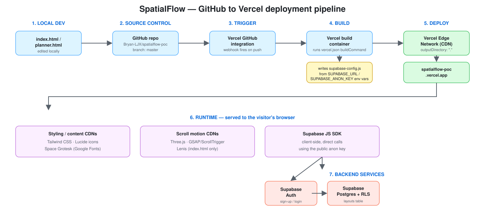

# SpatialFlow

A proof-of-concept marketing site for a fictional micro-office / studio
layout planner product. It's two static pages (no build step, no framework):
`index.html`, a cinematic, scroll-driven marketing shell, and `planner.html`,
a fully interactive room-planning tool it links to — plus optional user
accounts for saving layouts across devices.

**Live**: https://spatialflow-poc.vercel.app/

## What it does

- **Marketing shell** (`index.html`) — a dark, jeskojets.com-inspired scroll
  experience: a portal hero with a real WebGL scene and a GSAP-pinned scroll
  zoom-through, Lenis-smoothed scrolling throughout, a per-section palette
  journey, a scroll-driven parallax glide on the showcase chair, an
  accordion, a spec table, and a dark finale.
- **Interactive planner** (`planner.html`) — drag furniture onto a scaled
  floor plan and get live feedback:
  - Hard invariants: items can't leave the room or overlap.
  - Soft invariant: a clearance warning for furniture placed too close
    together (non-blocking).
  - Live utilization %, estimated power draw and outlet count, an itemized
    shopping list with running total, and a JSON blueprint export.
- **Accounts (optional)** — sign up or log in with email/password (from
  either page) to save your layout to your account and pick it up from any
  device. Without an account, the planner still works and saves your layout
  locally to that one browser.

## Tech stack

- **Frontend**: plain HTML/CSS/JS, Tailwind CSS (CDN) for styling, Lucide
  for icons, Space Grotesk (Google Fonts) for display type. No bundler, no
  package.json, no framework — everything is loaded from CDNs, including
  ES modules resolved via a `<script type="importmap">` (`index.html`,
  `assets/js/`) so `import` statements work with no build step.
- **Scroll motion** (`index.html` only): [Three.js](https://threejs.org)
  for the hero's WebGL scene, [GSAP](https://gsap.com) + ScrollTrigger for
  pinning/scrubbing/reveal timelines, and [Lenis](https://lenis.dev) for
  smooth scrolling — all free/MIT, all CDN-delivered. `planner.html` doesn't
  load any of this, so planner-only visitors don't pay for it.
- **Auth + database**: [Supabase](https://supabase.com) — Auth for
  email/password sign-up and login, Postgres for per-user layout storage.
  The browser talks to Supabase directly via its public anon key; a Row
  Level Security policy on the `layouts` table (`user_id = auth.uid()`)
  ensures each account can only ever read or write its own row.
- **Hosting**: [Vercel](https://vercel.com) (free tier), deployed from this
  GitHub repo. A `vercel.json` build step writes `supabase-config.js` from
  Vercel environment variables at deploy time, so no key is ever committed.

## Running it locally

This is a static site — any local file server works:

```bash
python3 -m http.server 8123
```

Then open `http://localhost:8123`. (Serving over `http://` rather than
`file://` is required for `localStorage` to work.)

To exercise the sign-up/login/save features locally, copy
[`supabase-config.example.js`](supabase-config.example.js) to
`supabase-config.js` and fill in your own Supabase project's URL and anon
public key (Supabase dashboard → Project Settings → API). That file is
gitignored and never gets committed.

## Deploying your own copy

1. Create a Supabase project, then run the SQL in
   [`openspec/changes/archive/`](openspec/changes/archive/) (see the
   `add-user-auth-persistence` change) to create the `layouts` table and
   its Row Level Security policies.
2. Import this repo into Vercel and set `SUPABASE_URL` and
   `SUPABASE_ANON_KEY` as environment variables in the Vercel project
   settings — `vercel.json`'s build command injects them into the deployed
   `supabase-config.js` automatically.
3. Deploy.

## CI/CD pipeline

Every push to `master` ships automatically — no manual deploy step, no
server to log into.



**What happens on `git push`:**

1. **GitHub** stores the code and, via the **Vercel GitHub integration**
   (a webhook), notifies Vercel the instant `master` changes.
2. **Vercel** clones the new commit into a fresh build container and runs
   the `buildCommand` from [`vercel.json`](vercel.json): it writes
   `supabase-config.js`, filling in `SUPABASE_URL` and `SUPABASE_ANON_KEY`
   from environment variables set in the Vercel dashboard — the real key is
   never committed to git.
3. Whatever lands in `outputDirectory` (`.`, the repo root) is published to
   **Vercel's Edge Network**, a global CDN, and the live URL
   (`spatialflow-poc.vercel.app`) is updated to point at the new deployment.
   Previous deployments stay available in the Vercel dashboard.
4. In the browser, the two pages load their styling/motion libraries
   (Tailwind, Lucide, Google Fonts, Three.js/GSAP/Lenis) straight from CDNs,
   and the **Supabase JS SDK** talks directly to **Supabase Auth** and
   **Supabase Postgres** (protected by Row Level Security) using the public
   anon key baked in at build time.

## Project structure

```
index.html          — the marketing shell: markup, styles, and app logic
planner.html         — the Micro-Office Layout Builder, its own page
assets/js/
  site-auth.js       — shared ES module: sign-up/sign-in/sign-out/session,
                       imported by both index.html and planner.html
  marketing-scene.js — index.html-only: Three.js hero scene, Lenis, GSAP/
                       ScrollTrigger reveal and showcase-chair animations
images/              — marketing and furniture-catalog images (see CREDITS.md)
docs/                — the categorical architecture model and its status
openspec/            — change proposals/specs/designs/tasks (OpenSpec workflow)
```

This project documents its own architecture as a formal model (objects,
morphisms, locations, transmissions) rather than free-form prose — see
[`docs/site/ARCHITECTURE.md`](docs/site/ARCHITECTURE.md) for what the system
is, and [`docs/site/STATUS.md`](docs/site/STATUS.md) for what's built,
verified, and outstanding.

