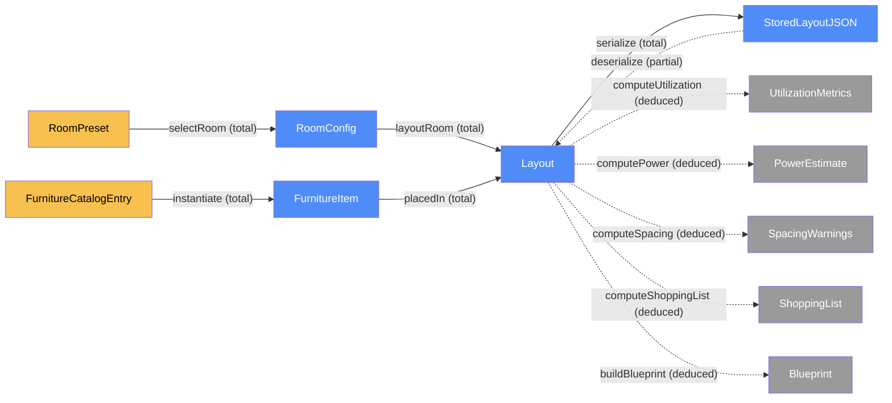
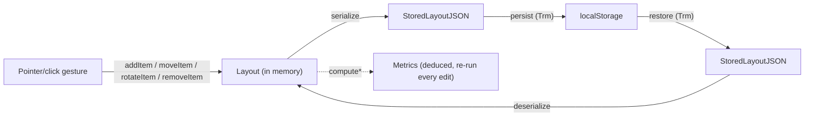
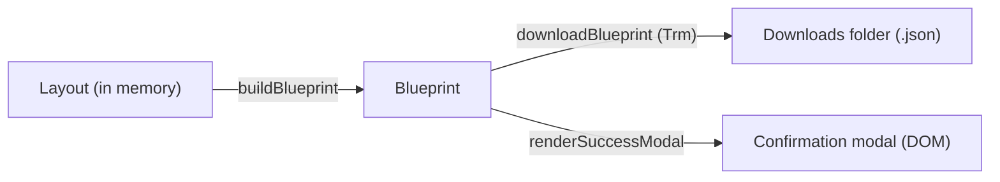

# Site — categorical model

> Model-first (FRAMEWORK §2/§4). Intended specification for this component; the
> code realises it (see IMPLEMENTATION.md). Source of record: `index.html`.

## 1. Overview

The entire SpatialFlow PoC: a single `index.html` file (Tailwind CSS + Lucide
icons via CDN `<script>`/`<link>` tags, vanilla JS, no build step, no backend)
that markets "small-space productivity pods and custom micro-studio layouts"
and demonstrates the concept with a client-side interactive planner — a
feet-scaled room floor plan onto which the visitor places modular furniture,
with real-time utilization/power/clearance calculations, an itemized
shopping-list-and-cost summary, and a blueprint export. There is only one
component because there is only one deployable artifact and no service
boundary to split on.

## 2. Why

Beyond the runtime/storage split (unchanged from the original model), this
revision adds a second real seam: **stored vs. deduced** state. Utilization,
power-outlet count, spacing warnings, shopping-list totals and blueprint
export are all *computable from* `Layout` — none of them may become a second
place that "what's on the grid" is stored, or they will drift from the
canvas the moment an item moves. Naming them as deduced morphisms up front is
what stops that drift before any code exists.

## 3. Core category

## 4. Morphism table

| Morphism | Signature | Partiality | Semantics |
| --- | --- | --- | --- |
| `selectRoom` | `RoomPreset → RoomConfig` | Total | picking a preset (e.g. 8×10 ft) fixes the room's working dimensions |
| `layoutRoom` | `RoomConfig → Layout` | Total | a layout always has exactly one room config |
| `placedIn` | `FurnitureItem → Layout` | Total | every placed item belongs to the current layout |
| `instantiate` | `FurnitureCatalogEntry → FurnitureItem` | Total | placing a catalog entry creates a placed item at default rotation |
| `serialize` | `Layout → StoredLayoutJSON` | Total | any in-memory layout can be turned into storable JSON |
| `deserialize` | `StoredLayoutJSON → Layout` | Partial | fails/falls back to default on malformed or missing storage |
| `computeUtilization` | `Layout → UtilizationMetrics` | Deduced | `usedSqFt / totalSqFt`; never stored, recomputed on every edit |
| `computePower` | `Layout → PowerEstimate` | Deduced | sums `watts` of powered items; outlets from item-count and wattage caps (§6) |
| `computeSpacing` | `Layout → SpacingWarnings` | Deduced | flags item pairs whose clearance buffers intersect (soft — does not block placement) |
| `computeShoppingList` | `Layout → ShoppingList` | Deduced | groups placed items by catalog type, sums quantity × unit cost |
| `buildBlueprint` | `Layout → Blueprint` | Deduced | snapshots room, items, and all four metrics above into one exportable record |

## 5. Functors

**Edit pipeline** — unchanged in shape from the original model, still the
spine everything else hangs off:

| Step | Signature | Partiality |
| --- | --- | --- |
| `addItem` | `(Layout, FurnitureCatalogEntry, x, y) → Layout` | Total (clamped to grid bounds) |
| `moveItem` | `(Layout, id, x, y) → Layout` | Partial — no-op if `id` absent or target cell occupied |
| `rotateItem` | `(Layout, id) → Layout` | Partial — no-op if `id` absent |
| `removeItem` | `(Layout, id) → Layout` | Partial — no-op if `id` absent |

**Export pipeline** — new. `Layout → Blueprint → JSON file`, the second arrow
a real cross-`Loc` transmission (§7):

## 6. Composition rules

1. `invariant: every FurnitureItem.x,y,w,h stays within RoomConfig bounds` — enforced at `addItem`/`moveItem`, never at render time. **Hard** — a violating placement is rejected outright, because it is physically impossible.
2. `invariant: no two FurnitureItem footprints in the same Layout overlap` — enforced at `addItem`/`moveItem`. **Hard**, same reason.
3. `deduction: deserialize = validate ∘ JSON.parse` — a `StoredLayoutJSON` that fails rules 1–2 is rejected, not repaired; `deserialize` falls back to the default empty `Layout`.
4. `deduction: computeUtilization = (Σ item.wFt·item.hFt) / (room.widthFt·room.heightFt)` — never stored; recomputed from `Layout.items` on every render.
5. `deduction: computePower = { totalWatts: Σ item.watts, outlets: max(⌈poweredCount / OUTLETS_PER_STRIP⌉, ⌈totalWatts / CIRCUIT_WATT_CAP⌉) }` where `OUTLETS_PER_STRIP = 4` and `CIRCUIT_WATT_CAP = 1800` (a standard 15A/120V circuit) — both constants named in code, not magic numbers.
6. `invariant (soft): spacing clearance` — each catalog entry declares a `clearanceFt` buffer; `computeSpacing` flags (but does not block) any pair of items whose *expanded* footprints (footprint + clearance) intersect. Soft because blocking on clearance near walls would make the demo unusable; the warning is the point, not a hard gate.
7. `deduction: computeShoppingList = groupBy(catalogId) ∘ map(item ↦ {qty: 1, unitCost: catalog[item.catalogId].cost})` then `Σ subtotal` for the total — never hand-maintained, always derived from current `Layout.items`.
8. `deduction: buildBlueprint = { room, items, computeUtilization, computePower, computeSpacing, computeShoppingList, timestamp: now() }` — the *only* place all four metrics are snapshotted together; the live summary panel calls the four `compute*` functions independently on every render instead of reading a stale `Blueprint`.

## 7. Atoms owned (FRAMEWORK §4)

**Trn** —

| `Trn` | `t_from → t_to` | Realising code |
| --- | --- | --- |
| `addItem` | `Layout → Layout` | planned |
| `moveItem` | `Layout → Layout` | planned |
| `rotateItem` | `Layout → Layout` | planned |
| `removeItem` | `Layout → Layout` | planned |
| `serialize` | `Layout → StoredLayoutJSON` | planned |
| `deserialize` | `StoredLayoutJSON → Layout` | planned |
| `renderGrid` | `Layout → DOM` | planned |
| `computeUtilization` | `Layout → UtilizationMetrics` | planned |
| `computePower` | `Layout → PowerEstimate` | planned |
| `computeSpacing` | `Layout → SpacingWarnings` | planned |
| `computeShoppingList` | `Layout → ShoppingList` | planned |
| `buildBlueprint` | `Layout → Blueprint` | planned |
| `downloadBlueprint` | `Blueprint → JSON file` | planned |

**Loc** — three: the **browser runtime** (in-memory `Layout`, DOM, event
handlers, Tailwind/Lucide CDN assets fetched once at load), **`localStorage`**
(persisted `StoredLayoutJSON`), and the **OS downloads folder** (exported
`.json` blueprint file). Plus two more added by `add-user-auth-persistence`
(§11): a **Supabase-hosted Auth/Postgres service** and a **Vercel-hosted
static origin**.

**Trm** — `persist : Layout(runtime) → StoredLayoutJSON(localStorage)`,
`restore : StoredLayoutJSON(localStorage) → Layout(runtime)`, and
`downloadBlueprint : Blueprint(runtime) → JSON file(downloads)`. These were
the only three real cross-`Loc` transmissions until `add-user-auth-persistence`
(§11) added `signUp`/`signIn`/`signOut`/`saveLayoutForUser`/
`loadLayoutForUser`; everything else (rendering, editing, computing metrics)
is same-`Loc` `Trn`.

**Placements (§4.2)** — none. Nothing here is placed at more than one `Loc`
simultaneously; the runtime, storage and download copies are distinct objects
related by `serialize`/`deserialize`/`buildBlueprint`, not shared placements
of one object.

## 8. Bridges to other components (ports)

None — this is the only component in the system.

## 9. Coherence notes

- **Law 1 (placement honesty):** no `Loc` claim beyond browser runtime,
  `localStorage`, and the downloads folder — the CDN fetches for Tailwind/
  Lucide happen once at page load and are not part of the app's own state
  model (they carry no `Layout` data), so they don't need a `Loc` of their
  own here.
- **Law 2 (transmission well-typing):** `persist`/`restore` carry
  `StoredLayoutJSON` only; `downloadBlueprint` carries a `Blueprint`, never a
  raw `Layout` — the exported file's shape is the deduced snapshot, not the
  live mutable state.
- **Law 5 (composition soundness):** `deserialize ∘ serialize = id` on any
  `Layout` satisfying rules 1–2 (unchanged from before); additionally, every
  `compute*` function must be a pure function of `Layout.items` with no
  hidden state — verified by construction (no `compute*` function reads or
  writes anything but its `Layout` argument).

## 10. Presentation layer (ambient, not modeled objects)

Added by the `redesign-jesko-aesthetic` change: a cinematic, scroll-driven
marketing shell (dark portal hero with a scroll zoom-through, a per-section
palette journey, oversized display type, a split headline, an accordion, a
spec table, and a near-black finale) wrapped around the **unchanged** planner.
This is deliberately **not** part of the category: scene/scroll/reveal/
accordion state is ephemeral DOM/CSS state — never serialized, never read by
any `compute*`, never affecting an invariant. It is ambient same-`Loc` `Trn`
(browser runtime → browser runtime DOM), not new `Dat`.

- **`initScrollReveal`** (`index.html:initScrollReveal`) — reveals
  `[data-reveal]` marketing nodes via `IntersectionObserver` (toggling
  `.is-revealed`); `prefers-reduced-motion` reveals all immediately. **Note:**
  a CSS `animation-timeline: view()` path was tried and removed — elements in
  the final screenful never complete their `entry` range before the page's
  scroll limit, leaving the finale/summary permanently hidden. IO fires on a
  visibility threshold, so reveals complete everywhere.
- **`initHeroZoom`** (`index.html:initHeroZoom`) — a rAF-throttled scroll
  handler that scales + fades the hero portal (the jesko "zoom through the
  window" effect). **Note:** CSS `animation-timeline: scroll()` proved inert
  in the target engine, so this is driven by JS over a legible `scale(1)`
  baseline; it is pure progressive enhancement and no-ops under
  `prefers-reduced-motion`. (Both CSS scroll-driven timelines — `scroll()` and
  `view()` — proved unreliable here; JS drives the motion instead.)
- **`initAccordion`** (`index.html:initAccordion`) — toggles `.is-open` on
  `.acc-item` advantage rows.
- **`initNavContrast`** (`index.html:initNavContrast`) — a scroll-spy that
  toggles `#site-nav.nav-dark` (dark nav text) when a `data-nav="light"`
  section is under the fixed nav, defaulting to white text over dark sections.
  Replaced a `mix-blend-mode: difference` nav that was illegible over the
  light sections. Colour-only, no motion.

**Planner-fence invariant.** None of these ever run inside `#planner`'s
dynamically re-rendered subtree (`#room-presets`, `#catalog-list`, `#board`,
the metrics `<aside>`). Enforced structurally: `[data-reveal]` is never
authored onto planner-internal elements (only onto the planner's *section
heading*, which is marketing framing), and the reveal/scene functions read
scroll/intersection signals and write `class`/`style` only — they never touch
`state.layout`. The planner is reframed as a bright "studio workbench" panel
(a deliberate light beat in the palette journey); only its section
container/heading changed, its internal markup and classes are unchanged.

**Palette journey.** Full-bleed sections each own their background and text
color, grounded in the existing `wood`/`stone` tokens plus a new `espresso`
scale: espresso hero → cream manifesto/advantages → gold showcase → light
workbench (planner) → dark blueprint summary → near-black finale.

**Furniture catalog images.** `FurnitureCatalogEntry` carries an `image`
attribute (a path into `images/furniture/`), rendered as `` in the
catalog swatch, on placed canvas items + the drag-ghost, and in shopping-list
rows, each with an `onerror` fallback to the Lucide icon + colour. It is
resolved at render time via the existing `catalogEntry(type)` lookup (exactly
like `color`): no new `Dat`, no `FurnitureItem`/`Layout`/`StoredLayoutJSON`
shape change, no effect on any `compute*` or invariant.

- **Law 1 (placement honesty) holds:** no new `Loc` — the cinematic layer,
  the Google-Fonts stylesheet, and the local `images/` assets (hero, showcase,
  and `images/furniture/`) are all fetched once by the existing browser
  runtime and carry no `Layout` data, exactly like the Tailwind/Lucide CDN
  assets (§9).

## 11. User & persistence layer (`add-user-auth-persistence`)

Unlike §10, this is a real model change — new `Dat`, `Trn`, `Loc`, and `Trm`,
not ambient presentation. See `openspec/changes/add-user-auth-persistence/`
(design.md) for the full rationale.

**New Dat:**

| Object | Form / shape | Loc |
| --- | --- | --- |
| `User` | Supabase Auth user record `{ id, email }` | Supabase Auth service |
| `StoredLayoutRow` | `{ user_id: uuid, layout: jsonb (= StoredLayoutJSON), updated_at: timestamptz }` | Supabase Postgres (`layouts` table) |

**New Trn / Trm:**

| Morphism | Signature | Kind | Partiality |
| --- | --- | --- | --- |
| `signUp` | `(email, password) → User` | `Trm` (browser → Supabase Auth) | Partial — fails on duplicate email or weak password |
| `signIn` | `(email, password) → User` | `Trm` (browser → Supabase Auth) | Partial — fails on bad credentials |
| `signOut` | `User → ()` | `Trm` (browser → Supabase Auth) | Total |
| `saveLayoutForUser` | `(User, Layout) → StoredLayoutRow` | `Trm` (browser → Supabase Postgres), via `serialize` | Partial — fails if unreachable; never for a user's own row under RLS |
| `loadLayoutForUser` | `User → Layout` | `Trm` (Supabase Postgres → browser), via `deserialize` | Partial — falls back to `defaultLayout()` when no row exists |

**New Loc:** a **Supabase-hosted Auth/Postgres service** (holds `User` and
`StoredLayoutRow`; reached only via the JS SDK + anon key, access controlled
by Row Level Security — `user_id = auth.uid()` on `select`/`insert`/`update`,
verified live by attempting a cross-account read and confirming it returns no
rows even with an unfiltered query), and a **Vercel-hosted static origin**
(production hosting for `index.html`/`images/`; carries no state of its own).

**`layoutStore` port (design.md Decision 4):** `addItem`/`moveItem`/
`rotateItem`/`removeItem`/`selectRoom`/`renderGrid` never learned that storage
moved — they still only ever trigger `afterEdit`, which now calls
`layoutStore.save`/`layoutStore.load` instead of `persist`/`restore`
directly. `layoutStore` picks `persist`/`restore` (signed-out) or
`saveLayoutForUser`/`loadLayoutForUser` (signed-in) based on `currentUser`.
Signed-out behavior (`localStorage`, key `spatialflow.layout.v2`) is
byte-for-byte unchanged — verified live.

**Coherence notes:**

- **Law 1 (placement honesty):** the two new `Loc`s are named explicitly and
  are the only new locations — no claim of caching, edge storage, or a
  custom backend server (there is none; see design.md Decision 5).
- **Law 2 (transmission well-typing):** `saveLayoutForUser`/
  `loadLayoutForUser` carry `StoredLayoutRow`/`StoredLayoutJSON` only, never a
  live in-memory `Layout` reference — same discipline as `persist`/`restore`.
- **Law 5 (composition soundness):** `loadLayoutForUser ∘ saveLayoutForUser =
  id` on any `Layout` satisfying the bounds/overlap invariants, mirroring
  `deserialize ∘ serialize = id` — `deserialize` still re-validates on the way
  back in regardless of which `Trm` produced the JSON.
- **Correctness note (found during implementation, fixed before verifying):**
  `currentUser` must be set synchronously in the `signUp`/`signIn`/`signOut`
  promise handlers themselves, not only by the async `onAuthStateChange`
  listener — otherwise an edit made in the brief window between a successful
  sign-in and that event firing could race and land in `localStorage` instead
  of Supabase (or vice versa on sign-out), silently violating the
  `layoutStore` port's isolation guarantee. `onAuthStateChange` is now used
  only for the one-time `INITIAL_SESSION` restore on page load.
