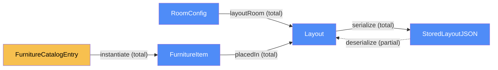
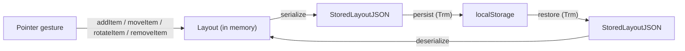

# Site — categorical model

> Model-first (FRAMEWORK §2/§4). Intended specification for this component; the
> code realises it (see IMPLEMENTATION.md). Source of record: `index.html`.

## 1. Overview

The entire SpatialFlow PoC: a single `index.html` file (inline/linked CSS + JS,
no build step, no backend) that markets the fictional "Micro-Office / Studio
Layout Planner" product and demonstrates it with a client-side interactive
planner — a grid room onto which the visitor drags furniture items, sees the
layout, and can save/reload it via `localStorage`. There is only one component
because there is only one deployable artifact and no service boundary to split
on.

## 2. Why

Even a one-file PoC has a real seam worth modeling: the planner's in-memory
layout state versus its persisted copy in `localStorage` are two distinct
locations with an explicit transmission between them (save/load), and the
marketing content versus the planner state are different objects that must not
be conflated. Naming that now stops the eventual planner logic from being
smeared across ad-hoc DOM event handlers with no single source of truth for
"what is on the grid."

## 3. Core category

## 4. Morphism table

| Morphism | Signature | Partiality | Semantics |
| --- | --- | --- | --- |
| `layoutRoom` | `RoomConfig → Layout` | Total | a layout always has exactly one room config |
| `placedIn` | `FurnitureItem → Layout` | Total | every placed item belongs to the current layout |
| `instantiate` | `FurnitureCatalogEntry → FurnitureItem` | Total | dragging a catalog entry onto the grid creates a placed item |
| `serialize` | `Layout → StoredLayoutJSON` | Total | any in-memory layout can be turned into storable JSON |
| `deserialize` | `StoredLayoutJSON → Layout` | Partial | fails/falls back to default on malformed or missing storage |

## 5. Functors

**Edit pipeline** (the only functor here — a linear pipeline from user gesture
to persisted state):

| Step | Signature | Partiality |
| --- | --- | --- |
| `addItem` | `(Layout, FurnitureCatalogEntry, x, y) → Layout` | Total (clamped to grid bounds) |
| `moveItem` | `(Layout, id, x, y) → Layout` | Partial — no-op if `id` absent or target cell occupied |
| `rotateItem` | `(Layout, id) → Layout` | Partial — no-op if `id` absent |
| `removeItem` | `(Layout, id) → Layout` | Partial — no-op if `id` absent |

## 6. Composition rules

1. `invariant: every FurnitureItem.x,y,w,h stays within RoomConfig bounds` — enforced at `addItem`/`moveItem`, never at render time.
2. `invariant: no two FurnitureItem footprints in the same Layout overlap` — enforced at `addItem`/`moveItem`.
3. `deduction: deserialize = validate ∘ JSON.parse` — a `StoredLayoutJSON` that fails the same bounds/overlap invariants above is rejected, not repaired; `deserialize` falls back to the default empty `Layout`.

## 7. Atoms owned (FRAMEWORK §4)

**Trn** —

| `Trn` | `t_from → t_to` | Realising code |
| --- | --- | --- |
| `addItem` | `Layout → Layout` | planned |
| `moveItem` | `Layout → Layout` | planned |
| `rotateItem` | `Layout → Layout` | planned |
| `removeItem` | `Layout → Layout` | planned |
| `serialize` | `Layout → StoredLayoutJSON` | planned |
| `deserialize` | `StoredLayoutJSON → Layout` | planned |
| `renderGrid` | `Layout → DOM` | planned |

**Loc** — two: the **browser runtime** (in-memory `Layout`, DOM, event
handlers) and **`localStorage`** (persisted `StoredLayoutJSON`). No server —
this PoC has no backend by requirement.

**Trm** — `persist : Layout(runtime) → StoredLayoutJSON(localStorage)` and
`restore : StoredLayoutJSON(localStorage) → Layout(runtime)`. These are the
only two real cross-`Loc` transmissions in the system; everything else
(rendering, editing) is same-`Loc` `Trn`.

**Placements (§4.2)** — none. Nothing here is placed at more than one `Loc`
simultaneously; the runtime copy and the storage copy are distinct objects
related by `serialize`/`deserialize`, not two placements of the same object.

## 8. Bridges to other components (ports)

None — this is the only component in the system.

## 9. Coherence notes

- **Law 1 (placement honesty):** the marketing content has no `Loc` claim
  beyond "renders in the browser" — satisfied trivially, no server round-trip
  is implied anywhere in copy or code.
- **Law 2 (transmission well-typing):** `persist`/`restore` both carry
  `StoredLayoutJSON`, never a raw `Layout` — `localStorage` only stores
  strings, so the type boundary is real, not decorative.
- **Law 5 (composition soundness):** `deserialize ∘ serialize = id` on any
  `Layout` satisfying the bounds/overlap invariants (composition rules 1–2) —
  this is the round-trip test `work` step 3 should assert.
