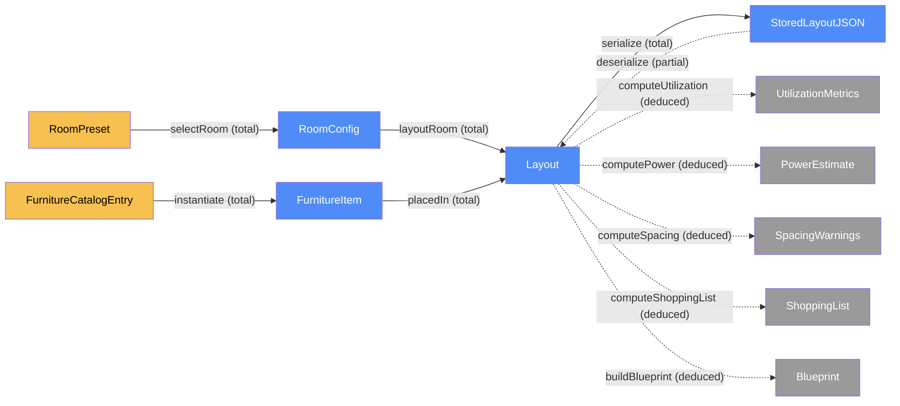
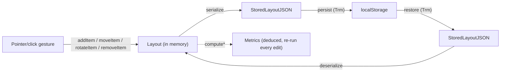
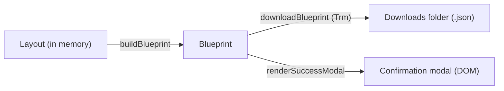

# Site — categorical model

> Model-first (FRAMEWORK §2/§4). Intended specification for this component; the
> code realises it (see IMPLEMENTATION.md). Source of record: `index.html`.

## 1. Overview

The entire SpatialFlow PoC: `index.html` (a dark, cinematic, scroll-driven
marketing shell — Tailwind CSS + Lucide icons via CDN, plus Three.js/Lenis/
GSAP for the hero/scroll motion, no build step) that markets "small-space
productivity pods and custom micro-studio layouts", and `planner.html` (the
client-side interactive planner it links to) — a feet-scaled room floor plan
onto which the visitor places modular furniture, with real-time
utilization/power/clearance calculations, an itemized shopping-list-and-cost
summary, and a blueprint export. `redesign-threejs-planner-split` moved the
planner from an embedded section into this second document; `assets/js/
site-auth.js` (a native ES module, imported by both pages) is the one shared
piece of code between them (§10). Still one component: both pages are static
files served from the same Vercel origin, both reach the same Supabase
backend, and there is no service boundary to split the model on — see §4.5
coherence notes for why two documents don't mean two `Loc`s.

## 2. Why

Beyond the runtime/storage split (unchanged from the original model), this
revision adds a second real seam: **stored vs. deduced** state. Utilization,
power-outlet count, spacing warnings, shopping-list totals and blueprint
export are all *computable from* `Layout` — none of them may become a second
place that "what's on the grid" is stored, or they will drift from the
canvas the moment an item moves. Naming them as deduced morphisms up front is
what stops that drift before any code exists.

## 3. Core category

## 4. Morphism table

| Morphism | Signature | Partiality | Semantics |
| --- | --- | --- | --- |
| `selectRoom` | `RoomPreset → RoomConfig` | Total | picking a preset (e.g. 8×10 ft) fixes the room's working dimensions |
| `layoutRoom` | `RoomConfig → Layout` | Total | a layout always has exactly one room config |
| `placedIn` | `FurnitureItem → Layout` | Total | every placed item belongs to the current layout |
| `instantiate` | `FurnitureCatalogEntry → FurnitureItem` | Total | placing a catalog entry creates a placed item at default rotation |
| `serialize` | `Layout → StoredLayoutJSON` | Total | any in-memory layout can be turned into storable JSON |
| `deserialize` | `StoredLayoutJSON → Layout` | Partial | fails/falls back to default on malformed or missing storage |
| `computeUtilization` | `Layout → UtilizationMetrics` | Deduced | `usedSqFt / totalSqFt`; never stored, recomputed on every edit |
| `computePower` | `Layout → PowerEstimate` | Deduced | sums `watts` of powered items; outlets from item-count and wattage caps (§6) |
| `computeSpacing` | `Layout → SpacingWarnings` | Deduced | flags item pairs whose clearance buffers intersect (soft — does not block placement) |
| `computeShoppingList` | `Layout → ShoppingList` | Deduced | groups placed items by catalog type, sums quantity × unit cost |
| `buildBlueprint` | `Layout → Blueprint` | Deduced | snapshots room, items, and all four metrics above into one exportable record |

## 5. Functors

**Edit pipeline** — unchanged in shape from the original model, still the
spine everything else hangs off:

| Step | Signature | Partiality |
| --- | --- | --- |
| `addItem` | `(Layout, FurnitureCatalogEntry, x, y) → Layout` | Total (clamped to grid bounds) |
| `moveItem` | `(Layout, id, x, y) → Layout` | Partial — no-op if `id` absent or target cell occupied |
| `rotateItem` | `(Layout, id) → Layout` | Partial — no-op if `id` absent |
| `removeItem` | `(Layout, id) → Layout` | Partial — no-op if `id` absent |

**Export pipeline** — new. `Layout → Blueprint → JSON file`, the second arrow
a real cross-`Loc` transmission (§7):

## 6. Composition rules

1. `invariant: every FurnitureItem.x,y,w,h stays within RoomConfig bounds` — enforced at `addItem`/`moveItem`, never at render time. **Hard** — a violating placement is rejected outright, because it is physically impossible.
2. `invariant: no two FurnitureItem footprints in the same Layout overlap` — enforced at `addItem`/`moveItem`. **Hard**, same reason.
3. `deduction: deserialize = validate ∘ JSON.parse` — a `StoredLayoutJSON` that fails rules 1–2 is rejected, not repaired; `deserialize` falls back to the default empty `Layout`.
4. `deduction: computeUtilization = (Σ item.wFt·item.hFt) / (room.widthFt·room.heightFt)` — never stored; recomputed from `Layout.items` on every render.
5. `deduction: computePower = { totalWatts: Σ item.watts, outlets: max(⌈poweredCount / OUTLETS_PER_STRIP⌉, ⌈totalWatts / CIRCUIT_WATT_CAP⌉) }` where `OUTLETS_PER_STRIP = 4` and `CIRCUIT_WATT_CAP = 1800` (a standard 15A/120V circuit) — both constants named in code, not magic numbers.
6. `invariant (soft): spacing clearance` — each catalog entry declares a `clearanceFt` buffer; `computeSpacing` flags (but does not block) any pair of items whose *expanded* footprints (footprint + clearance) intersect. Soft because blocking on clearance near walls would make the demo unusable; the warning is the point, not a hard gate.
7. `deduction: computeShoppingList = groupBy(catalogId) ∘ map(item ↦ {qty: 1, unitCost: catalog[item.catalogId].cost})` then `Σ subtotal` for the total — never hand-maintained, always derived from current `Layout.items`.
8. `deduction: buildBlueprint = { room, items, computeUtilization, computePower, computeSpacing, computeShoppingList, timestamp: now() }` — the *only* place all four metrics are snapshotted together; the live summary panel calls the four `compute*` functions independently on every render instead of reading a stale `Blueprint`.

## 7. Atoms owned (FRAMEWORK §4)

**Trn** —

| `Trn` | `t_from → t_to` | Realising code |
| --- | --- | --- |
| `addItem` | `Layout → Layout` | planned |
| `moveItem` | `Layout → Layout` | planned |
| `rotateItem` | `Layout → Layout` | planned |
| `removeItem` | `Layout → Layout` | planned |
| `serialize` | `Layout → StoredLayoutJSON` | planned |
| `deserialize` | `StoredLayoutJSON → Layout` | planned |
| `renderGrid` | `Layout → DOM` | planned |
| `computeUtilization` | `Layout → UtilizationMetrics` | planned |
| `computePower` | `Layout → PowerEstimate` | planned |
| `computeSpacing` | `Layout → SpacingWarnings` | planned |
| `computeShoppingList` | `Layout → ShoppingList` | planned |
| `buildBlueprint` | `Layout → Blueprint` | planned |
| `downloadBlueprint` | `Blueprint → JSON file` | planned |

**Loc** — three: the **browser runtime** (in-memory `Layout`, DOM, event
handlers, Tailwind/Lucide/Three.js/GSAP/Lenis CDN assets fetched once at
load — `index.html` and `planner.html` are two documents in this one `Loc`,
not two, per §1/§10), **`localStorage`** (persisted `StoredLayoutJSON`), and
the **OS downloads folder** (exported `.json` blueprint file). Plus two more
added by `add-user-auth-persistence` (§11): a **Supabase-hosted Auth/Postgres
service** and a **Vercel-hosted static origin**.

**Trm** — `persist : Layout(runtime) → StoredLayoutJSON(localStorage)`,
`restore : StoredLayoutJSON(localStorage) → Layout(runtime)`, and
`downloadBlueprint : Blueprint(runtime) → JSON file(downloads)`. These were
the only three real cross-`Loc` transmissions until `add-user-auth-persistence`
(§11) added `signUp`/`signIn`/`signOut`/`saveLayoutForUser`/
`loadLayoutForUser`; everything else (rendering, editing, computing metrics)
is same-`Loc` `Trn`.

**Placements (§4.2)** — none. Nothing here is placed at more than one `Loc`
simultaneously; the runtime, storage and download copies are distinct objects
related by `serialize`/`deserialize`/`buildBlueprint`, not shared placements
of one object.

## 8. Bridges to other components (ports)

None — this is the only component in the system.

## 9. Coherence notes

- **Law 1 (placement honesty):** no `Loc` claim beyond browser runtime,
  `localStorage`, and the downloads folder — the CDN fetches for Tailwind/
  Lucide happen once at page load and are not part of the app's own state
  model (they carry no `Layout` data), so they don't need a `Loc` of their
  own here.
- **Law 2 (transmission well-typing):** `persist`/`restore` carry
  `StoredLayoutJSON` only; `downloadBlueprint` carries a `Blueprint`, never a
  raw `Layout` — the exported file's shape is the deduced snapshot, not the
  live mutable state.
- **Law 5 (composition soundness):** `deserialize ∘ serialize = id` on any
  `Layout` satisfying rules 1–2 (unchanged from before); additionally, every
  `compute*` function must be a pure function of `Layout.items` with no
  hidden state — verified by construction (no `compute*` function reads or
  writes anything but its `Layout` argument).

## 10. Presentation layer (ambient, not modeled objects)

Added by `redesign-jesko-aesthetic`, rewired onto a real WebGL/GSAP stack and
split across two documents by `redesign-threejs-planner-split`: a cinematic,
scroll-driven marketing shell (dark portal hero with a scroll zoom-through, a
per-section palette journey, oversized display type, a split headline, an
accordion, a spec table, and a near-black finale) on `index.html`, linking to
the planner on its own page. This is deliberately **not** part of the
category: scene/scroll/reveal/accordion state is ephemeral DOM/CSS/WebGL
state — never serialized, never read by any `compute*`, never affecting an
invariant. It is ambient same-`Loc` `Trn` (browser runtime → browser runtime
DOM/canvas), not new `Dat`.

- **`initScrollReveal`** (`assets/js/marketing-scene.js:initScrollReveal`) —
  reveals `[data-reveal]` marketing nodes via a one-shot `ScrollTrigger` per
  node (replacing the prior `IntersectionObserver`, same `.is-revealed`
  contract); `prefers-reduced-motion` reveals all immediately, same as before.
- **`initHeroScrub` / `initHeroScene`**
  (`assets/js/marketing-scene.js:initHeroScrub`,
  `assets/js/marketing-scene.js:initHeroScene`) — replace the prior rAF-driven
  `initHeroZoom`. `initHeroScrub` pins the hero and scrubs the portal's
  scale/opacity via GSAP `ScrollTrigger` (`pin: true`, `scrub: true`) — the
  direct replacement for the old CSS-approximated zoom, and also the
  WebGL-unavailable fallback (same visual effect, no 3D). `initHeroScene`
  feature-detects WebGL and, when available, layers a Three.js scene (a small
  cluster of brand-colored blocks) into the portal, dollying the camera and
  rotating the group as `initHeroScrub`'s progress advances — the real WebGL
  depth jeskojets.com's transition uses, instead of a flat scale/fade. Paused
  via `IntersectionObserver` once the hero scrolls out of view (no render
  loop for an off-screen canvas). Both no-op under `prefers-reduced-motion`
  beyond one static WebGL frame.
- **`initLenis`** (`assets/js/marketing-scene.js:initLenis`) — smooth
  scrolling via Lenis, ticked from `gsap.ticker` with `autoRaf: false` (Lenis
  must not run its own rAF loop alongside GSAP's — see Notes/divergences) and
  synced to `ScrollTrigger.update()` on every Lenis scroll event. Skipped
  entirely under `prefers-reduced-motion` — native scroll instead.
- **`initShowcaseSpin`** (`assets/js/marketing-scene.js:initShowcaseSpin`,
  `add-showcase-chair-spin`) — a diagonal parallax glide for the `#showcase`
  chair image (drifts lower-left → upper-right while growing ~44% larger)
  over its section's entire time on screen, via a scrubbed (not pinned)
  `ScrollTrigger`. Two earlier iterations were rejected live: a full 360°
  rotation (read as broken, not premium) and a small parallax rise (too
  subtle to notice). No-ops under `prefers-reduced-motion`.
- **`initAccordion`** (`index.html:initAccordion`) — toggles `.is-open` on
  `.acc-item` advantage rows. Unchanged, plain vanilla JS — no dependency on
  the WebGL/GSAP/Lenis stack.
- **`initNavContrast`** (`index.html:initNavContrast`) — a scroll-spy that
  toggles `#site-nav.nav-dark` (dark nav text) when a `data-nav="light"`
  section is under the fixed nav, defaulting to white text over dark sections.
  Unchanged, plain vanilla JS. (`planner.html` doesn't need this — its own nav
  is permanently light-styled, since the whole page is light-toned.)

**Shared auth module.** `assets/js/site-auth.js` (a native ES module,
imported via `<script type="module">` by both `index.html` and
`planner.html`) is the one piece of code both documents share — see §11 for
its exported `Trm`s.

**Planner-fence invariant — now structural, not just enforced.** Before the
split, none of the functions above ever ran inside `#planner`'s dynamically
re-rendered subtree; after the split, `index.html` contains no planner markup
or state-machine code at all, so the invariant can't be violated by
construction rather than by convention.

**Palette journey.** Full-bleed sections each own their background and text
color, grounded in the existing `wood`/`stone` tokens plus a new `espresso`
scale: espresso hero → cream manifesto/advantages → gold showcase → light
workbench (planner) → dark blueprint summary → near-black finale.

**Furniture catalog images.** `FurnitureCatalogEntry` carries an `image`
attribute (a path into `images/furniture/`), rendered as `` in the
catalog swatch, on placed canvas items + the drag-ghost, and in shopping-list
rows, each with an `onerror` fallback to the Lucide icon + colour. It is
resolved at render time via the existing `catalogEntry(type)` lookup (exactly
like `color`): no new `Dat`, no `FurnitureItem`/`Layout`/`StoredLayoutJSON`
shape change, no effect on any `compute*` or invariant.

- **Law 1 (placement honesty) holds:** no new `Loc` — the cinematic layer,
  the Google-Fonts stylesheet, and the local `images/` assets (hero, showcase,
  and `images/furniture/`) are all fetched once by the existing browser
  runtime and carry no `Layout` data, exactly like the Tailwind/Lucide CDN
  assets (§9).

## 11. User & persistence layer (`add-user-auth-persistence`)

Unlike §10, this is a real model change — new `Dat`, `Trn`, `Loc`, and `Trm`,
not ambient presentation. See `openspec/changes/add-user-auth-persistence/`
(design.md) for the full rationale.

**New Dat:**

| Object | Form / shape | Loc |
| --- | --- | --- |
| `User` | Supabase Auth user record `{ id, email }` | Supabase Auth service |
| `StoredLayoutRow` | `{ user_id: uuid, layout: jsonb (= StoredLayoutJSON), updated_at: timestamptz }` | Supabase Postgres (`layouts` table) |

**New Trn / Trm:**

| Morphism | Signature | Kind | Partiality | Realised at |
| --- | --- | --- | --- | --- |
| `signUp` | `(email, password) → User` | `Trm` (browser → Supabase Auth) | Partial — fails on duplicate email or weak password | `assets/js/site-auth.js:signUp` |
| `signIn` | `(email, password) → User` | `Trm` (browser → Supabase Auth) | Partial — fails on bad credentials | `assets/js/site-auth.js:signIn` |
| `signOut` | `User → ()` | `Trm` (browser → Supabase Auth) | Total | `assets/js/site-auth.js:signOut` |
| `saveLayoutForUser` | `(User, Layout) → StoredLayoutRow` | `Trm` (browser → Supabase Postgres), via `serialize` | Partial — fails if unreachable; never for a user's own row under RLS | `planner.html:saveLayoutForUser` |
| `loadLayoutForUser` | `User → Layout` | `Trm` (Supabase Postgres → browser), via `deserialize` | Partial — falls back to `defaultLayout()` when no row exists | `planner.html:loadLayoutForUser` |

`redesign-threejs-planner-split` moved `signUp`/`signIn`/`signOut` (identity)
into the shared `assets/js/site-auth.js` module and kept
`saveLayoutForUser`/`loadLayoutForUser` (the `layouts`-table `Trm`) in
`planner.html` alongside `layoutStore` — a relocation only, no signature or
behavior change; all five were previously realised in `index.html`.

**New Loc:** a **Supabase-hosted Auth/Postgres service** (holds `User` and
`StoredLayoutRow`; reached only via the JS SDK + anon key, access controlled
by Row Level Security — `user_id = auth.uid()` on `select`/`insert`/`update`,
verified live by attempting a cross-account read and confirming it returns no
rows even with an unfiltered query), and a **Vercel-hosted static origin**
(production hosting for `index.html`/`images/`; carries no state of its own).

**`layoutStore` port (design.md Decision 4):** `addItem`/`moveItem`/
`rotateItem`/`removeItem`/`selectRoom`/`renderGrid` never learned that storage
moved — they still only ever trigger `afterEdit`, which now calls
`layoutStore.save`/`layoutStore.load` instead of `persist`/`restore`
directly. `layoutStore` picks `persist`/`restore` (signed-out) or
`saveLayoutForUser`/`loadLayoutForUser` (signed-in) based on `currentUser`.
Signed-out behavior (`localStorage`, key `spatialflow.layout.v2`) is
byte-for-byte unchanged — verified live. Since `redesign-threejs-planner-split`,
`currentUser` is read via `assets/js/site-auth.js:getCurrentUser` instead of a
page-local variable; no other change to the port.

**Correctness note (`redesign-threejs-planner-split`, found live while
verifying):** `saveLayoutForUser`/`loadLayoutForUser` were first implemented
against a second Supabase client instantiated locally in `planner.html`
(mirroring the pre-split `index.html` code exactly). Every `createClient()`
call spins up its own `GoTrueClient` managing the shared
`sb-<project>-auth-token` `localStorage` key — even for a client that never
touches `.auth` — so two independent clients on one page raced over that key
and triggered the Supabase SDK's own "Multiple GoTrueClient instances"
warning. Fixed by adding `assets/js/site-auth.js:getSupabaseClient` and having
`planner.html` reuse that one client for its `.from("layouts")` calls instead
of creating a second one.

**Coherence notes:**

- **Law 1 (placement honesty):** the two new `Loc`s are named explicitly and
  are the only new locations — no claim of caching, edge storage, or a
  custom backend server (there is none; see design.md Decision 5).
- **Law 2 (transmission well-typing):** `saveLayoutForUser`/
  `loadLayoutForUser` carry `StoredLayoutRow`/`StoredLayoutJSON` only, never a
  live in-memory `Layout` reference — same discipline as `persist`/`restore`.
- **Law 5 (composition soundness):** `loadLayoutForUser ∘ saveLayoutForUser =
  id` on any `Layout` satisfying the bounds/overlap invariants, mirroring
  `deserialize ∘ serialize = id` — `deserialize` still re-validates on the way
  back in regardless of which `Trm` produced the JSON.
- **Correctness note (found during implementation, fixed before verifying):**
  `currentUser` must be set synchronously in the `signUp`/`signIn`/`signOut`
  promise handlers themselves, not only by the async `onAuthStateChange`
  listener — otherwise an edit made in the brief window between a successful
  sign-in and that event firing could race and land in `localStorage` instead
  of Supabase (or vice versa on sign-out), silently violating the
  `layoutStore` port's isolation guarantee. `onAuthStateChange` is now used
  only for the one-time `INITIAL_SESSION` restore on page load.
